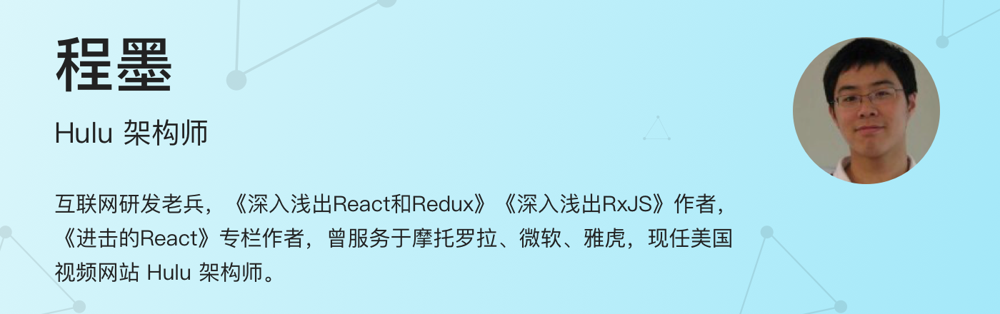
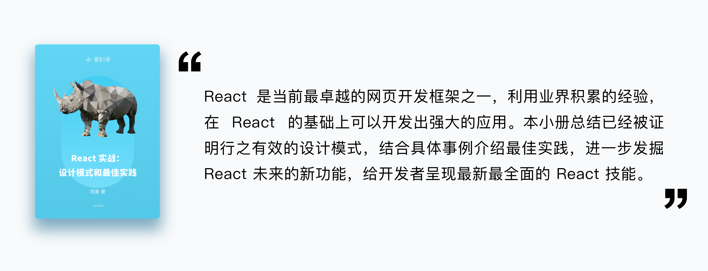

> 深入了解 React 应用中的设计模式，总结业界验证的最佳实践，更进一步，了解React 未来新功能 Suspense 和 Hooks。

## 目录

- [React 的设计思想](./s_76195.md)
- [组件实践（1）：如何定义清晰可维护的接口](./s_76208.md)
- [组件实践（2）：组件的内部实现](./s_76210.md)
- [组件实践（3）：组件化样式](./s_76211.md)
- [组件设计模式（1）：聪明组件和傻瓜组件](./s_76212.md)
- [组件设计模式（2）：高阶组件](./s_76213.md)
- [组件设计模式（3）：render props 模式](./s_76301.md)
- [组件设计模式（4）： 提供者模式](./s_76302.md)
- [组件设计模式（5）：组合组件](./s_76514.md)
- [React 单元测试](./s_76515.md)
- [React 状态管理（1）：组件状态](./s_76516.md)
- [React 状态管理（2）：Redux 使用模式](./s_76517.md)
- [React 状态管理（3）：Mobx  使用模式](./s_76518.md)
- [React 状态管理（4）：不同方式对比](./s_76519.md)
- [路由的魔法：React Router](./s_76520.md)
- [服务器端渲染（1）：基本套路](./s_76521.md)
- [服务器端渲染（2）：理解 Next.js](./s_76522.md)
- [React 的未来（1）：拥抱异步渲染](./s_76523.md)
- [React 的未来（2）：Suspense 带来的异步操作革命](./s_76524.md)
- [React 的未来（3）：函数化的 Hooks](./s_76527.md)
- [结语](./s_76585.md)

## (介绍)

## 作者介绍

<figure><figcaption></figcaption></figure>

程墨，互联网研发老兵，《[深入浅出React和Redux](https://item.jd.com/12073933.html)》《[深入浅出RxJS](https://item.jd.com/12336101.html)》作者，《[进击的React](https://zhuanlan.zhihu.com/advancing-react)》专栏作者，曾服务于摩托罗拉、微软、雅虎，现任美国视频网站 Hulu 架构师。

## 小册介绍

React 是当前最热门的网页开发框架之一，其简洁易用的特点吸引了全世界的网页开发者。React 只是一个工具，并没有强制要求开发者按照什么套路去开发应用，但这也给开发者带来一些迷茫，当遇到一个具体问题的时候，不知道该选取什么样的方法去解决。这个小册的目的，就是要解除 React 使用者的迷惑，帮助大家快速找到解决问题的办法。

<figure><figcaption></figcaption></figure>

软件开发中，一切皆有模式，模式指的是对于一类相似问题的通用解决方法。这个小册会从应用 React 的原理入手，针对每一个具体的需求，提供满足各个需求的设计模式。设计模式只是一种思想，最后依然要落实到具体的代码，这就需要应用在开发过程中被千锤百炼提炼出来的最佳实践。

React 技术发展迅速，设计模式和最佳实践也在不断进化，本小册不仅总结了历史证明行之有效的做法，对最新的 React Suspense 和 Hooks 带来的改变也做了深入的介绍。

## 你会学到什么？

你会学到完整的 React 应用设计模式，以及经过业界验证的 React 最佳实践，除此之外，你还将感受到 React 未来功能 Suspense 和 Hooks 带来的模式变化。

本小册中的示例代码在github上可以找到： [https://github.com/mocheng/react-practice](https://github.com/mocheng/react-practice) 。

## 适宜人群

对 React 已经有初步了解，想要进一步提高自己 React 应用段位的开发者。

## 购买须知

1. 本小册为图文形式内容服务，共计 21 节，上线时间为 2018 年 12 月 11 日；
2. 购买用户可享有小册永久的阅读权限；
3. 购买用户可进入小册微信群，与作者互动；
4. 掘金小册为虚拟内容服务，一经购买成功概不退款；
5. 掘金小册版权归北京北比信息技术有限公司所有，任何机构、媒体、网站或个人未经本网协议授权不得转载、链接、转贴或以其他方式复制发布/发表，违者将依法追究责任；
6. 在掘金小册阅读过程中，如有任何问题，请邮件联系 [xiaoce@xitu.io](mailto:xiaoce@xitu.io)。

        