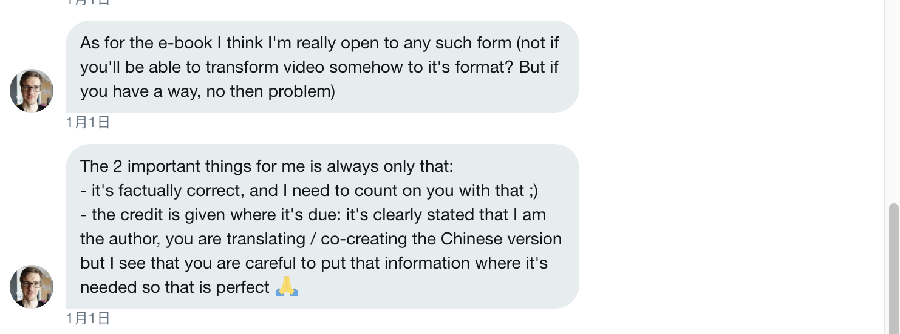

> 熟练掌握 Chrome 调试技巧，直接提升工作效率。

## 目录

- [写在前面](./s_77273.md)
- [通用篇 - copying & saving ](./s_77274.md)
- [通用篇 - 快捷键和通用技巧](./s_77275.md)
- [通用篇 - 使用 Command](./s_77276.md)
- [通用篇 - 代码块的使用](./s_77277.md)
- [console 篇 - console 中的 '$'](./s_77278.md)
- [console 篇 - console 的 "bug" ?](./s_77279.md)
- [console 篇 - 异步的 console](./s_77280.md)
- [console 篇 - Ninja console.log （忍者打印） ](./s_77281.md)
- [console 篇 - 自定义格式转换器](./s_77282.md)
- [console 篇 - 对象 & 方法](./s_77283.md)
- [console 篇 - console 中骚操作](./s_77284.md)
- [Network 篇 - Network 的骚操作](./s_77285.md)
- [元素面板篇 - 技巧集合](./s_77286.md)
- [元素面板篇 - 颜色选择器](./s_77287.md)
- [Drawer 篇 - Drawer 常识](./s_77288.md)
- [Workspace 篇 - workspace 技巧](./s_77289.md)
- [结束语](./s_77290.md)

## (介绍)

# 免费阅读

如果你不想购买，小册支持在线免费阅读，因为小册的本意是为了帮助更多的人了解 Chrome Devtools，免费阅读：[仓库地址](https://github.com/dendoink/FrontendWingman)，欢迎 star 支持。

## 小册介绍

这是一本关于使用 `Chrome` 调试工具的技巧的介绍，由 Tomek 发布在 Medium上的 “Advent calendar for front-end developers” 系列为基础，翻译后，重新整合分类，改编而来。
从不同的情景来说明应该如何搭配使用 `Chrome DevTools` 中的小技巧，有些时候一个技巧可以节省我们很多的时间，也会让调试的过程变得更加简单直接。

## 作者介绍

Tomek Sułkowski, 来自波兰的小哥 [Twitter](https://twitter.com/sulco) , `Angular Tricity` 联合创始人/ `Angular` 专家 , 在 [Medium专栏](https://t.co/IFU5poPEla) 发布多篇文章, Medium `frontend.coach` 专栏作者，拥有 15k 关注，擅长 `Typescript`等前端技术。

## 译者介绍

Dendoink, 玩过1年 `Java` , 3 年前端, 掘金专栏作者，联合编辑。

## 授权记录

<figure><figcaption></figcaption></figure>

## 你会学到什么？

*  不常用但是却高效的调试技巧。
*  常用的调试方法的高端玩法。
*  对 `Chrome DevTools` 各个部分功能的深入理解。

## 适宜人群

*  没有使用过 `Chrome DevTools` 但是感兴趣的小伙伴。
*  有使用过 `Chrome` 进行调试，但是想更加深入理解的小伙伴。

## 购买须知

1. 这本小册的定价是 `0.01` 元并不代表它的价值就是 `0.01` 元，而是因为作者的本意是分享而非获利。
2. 本小册为图文形式内容服务，共计 18 节；
3. 全部文章预计 2019 年 1 月 20 日更新完成；
4. 购买用户可享有小册永久的阅读权限；
5. 购买用户可进入小册微信群，与作者互动；
6. 掘金小册为虚拟内容服务，一经购买成功概不退款；
7. 掘金小册版权归北京北比信息技术有限公司所有，任何机构、媒体、网站或个人未经本网协议授权不得转载、链接、转贴或以其他方式复制发布/发表，违者将依法追究责任；
8. 在掘金小册阅读过程中，如有任何问题，请邮件联系 xiaoce@xitu.io

        