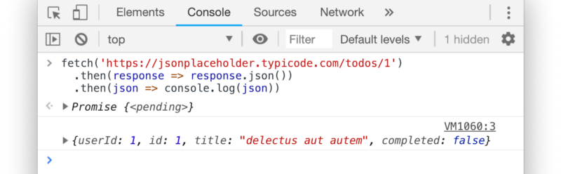
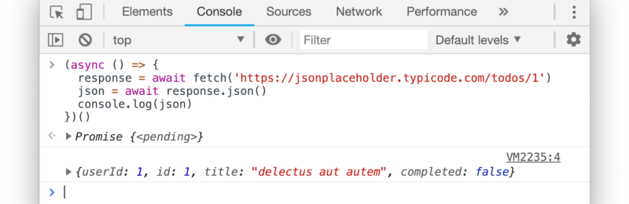
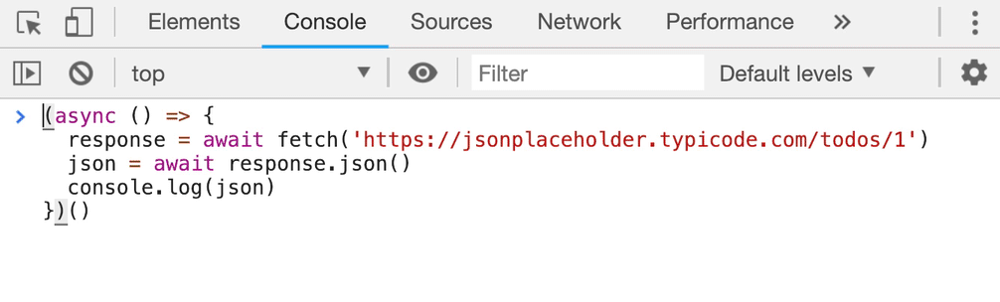
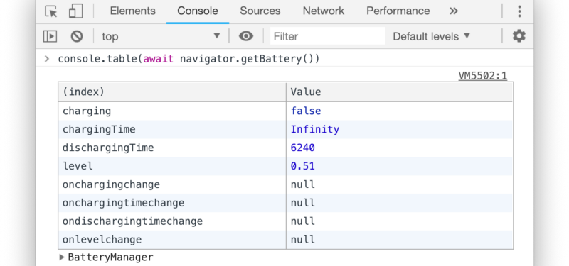
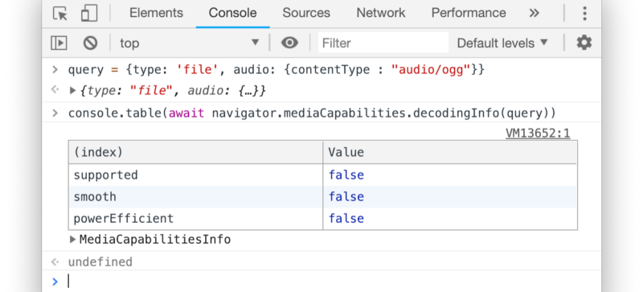
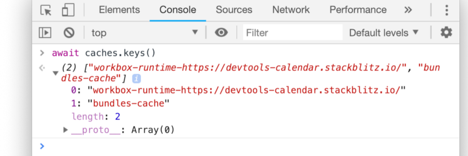

# console篇 - 异步的 console

如今，越来越多与浏览器有关的 API 都是 *基于 `Promise` 的* 。当你使用 `promise` 的时候通常配套用 `.then(处理方法)` 或者 将 `promise` 包裹在 `async` 方法中，再使用 `await` 来接收结果。

我们在 `JavaScript/TypeScript` 中大量使用的东西，但如果在 `Console` 中书写这样的结构很不方便。

像下面这样

<figure><figcaption></figcaption></figure>

或者这样

<figure><figcaption></figcaption></figure>

这样太难用了！不是输入之前就被触发了，就是括号漏写了...

>**但如果 `console` 默认就被 `async` 包裹呢？**

你猜怎么着，还真是这样！你可以直接使用 `await` ：

<figure><figcaption></figcaption></figure>

事实上,在 `Console` 中使用 `promise` 比在源码中使用起来还要简单！

## 1. 用你的异步`console` 来看一些更酷的东西

我和你一样，觉得 `fetch` 的例子相当无聊 -- 所以再来一个新玩法：通过 `console` 来获取到更多有意思的信息。

*  `Storage` 系统的 **占用数** 和 **空闲数**

```javascript
await navigator.storage.estimate()
```

<figure><figcaption></figcaption></figure>

*  设备的 **电池信息**

为了达到更好的效果，我们将这个技巧和前几天中提到的 `console.table` 来合并使用：

敲黑板：这是一条[不推荐使用的API](https://developer.mozilla.org/en-US/docs/Web/API/Battery_Status_API),尽管看起来这么酷炫...

<figure><figcaption></figcaption></figure>

*  **媒体能力**

<figure><figcaption></figcaption></figure>

*  **Cache storage keys**

(注：[Cache storage keys](https://developer.mozilla.org/en-US/docs/Web/API/CacheStorage) 一般用来对 `request` 和 `response` 进行缓存)

<figure><figcaption></figcaption></figure>

更多的例子就不一一举例了。


            