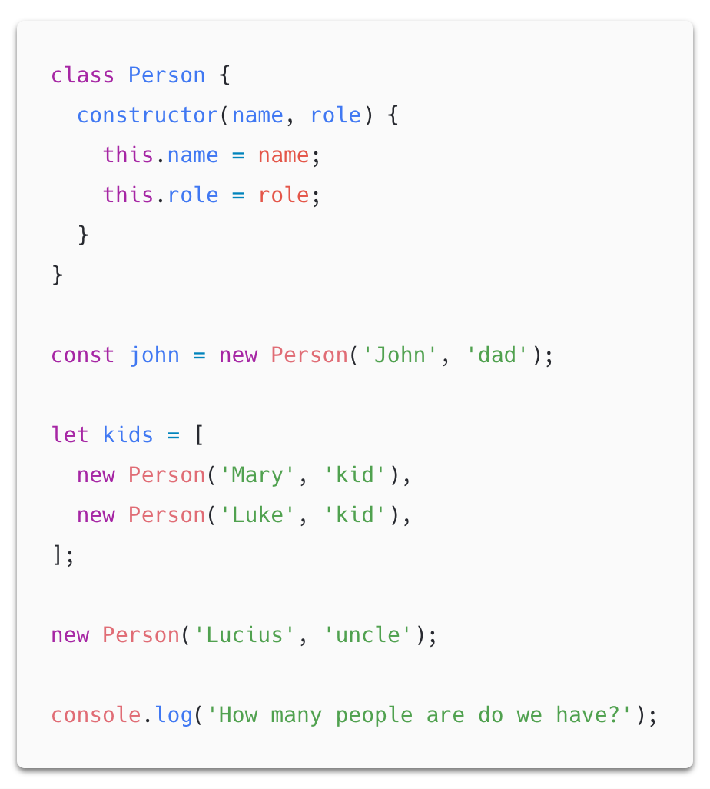
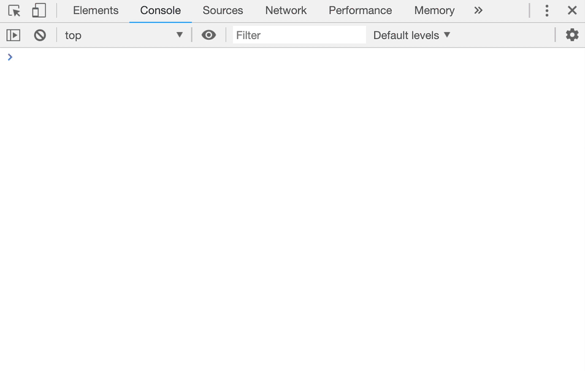
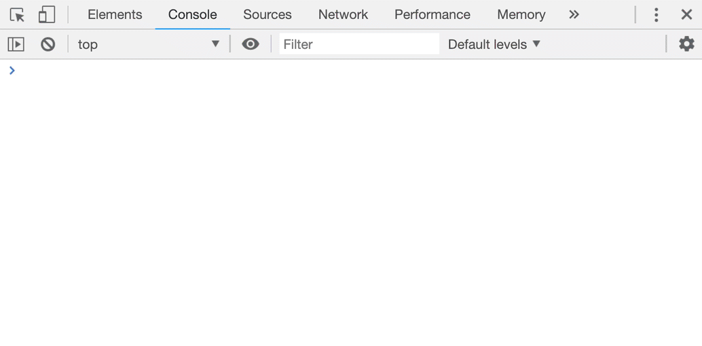
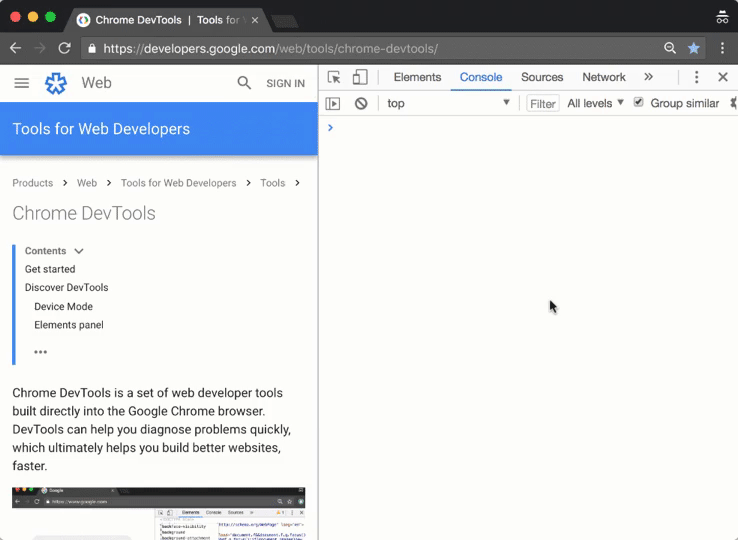

# console篇 - 对象&方法

## 前言

在我们调试 `Javascript` 的代码时，`对象` 和 `方法` 作为经常被我们调试的对象，所以这里介绍关于 `对象` 和 `方法` 的调试技巧。

## 1. `queryObjects` （对象查询）方法

<figure><figcaption></figcaption></figure>

假如我们有这样一段代码，我们在里面定义了一些对象。

问一个问题，我们怎么知道，在 **特定的时刻** + **特定的执行上下文** 有哪些对象呢？

`DevTools` 里的 `queryObjects` 函数可以展示这些信息。

>请注意，列表中创建的最后一个对象是不可用的 :  在代码执行后，对于它的引用并没有留存下来，也就是说，我们只有 `3` 个 `person` 对象：

<figure><figcaption></figcaption></figure>

## 2. `monitor` （镜像）方法

`monitor` 是 `DevTools` 的一个方法， 它能够让你 `“潜入”` 到任何 `_function calls(方法的调用)` 中：每当一个 `被潜入` 的方法运行的时候，`console 控制台` 会把它的实例打印出来，包含 **函数名** 以及 **调用它的参数** 。

我们把前面例子里面的 `Person` 类拿过来，并且给它扩展两个方法：

```javascript
class Person {
  constructor(name, role) {
    this.name = name;
    this.role = role;
  }

  greet() {
    return this.getMessage('greeting');
  }
  getMessage(type) {
    if (type === 'greeting') {
      return `Hello, I'm ${this.name}!`;
    }
  }
}
```

如你所见，`greet` 方法通过一个特殊的参数来执行 `getMessage` 方法，让我们看看对 `getMessage` 方法进行追踪会产生什么结果：

<figure><figcaption></figcaption></figure>

这样做，会让我们少写很多 `console.logs` !

### 3. `monitorEvents` （镜像事件）方法

在上文中，我们讨论了用 `monitor` 方法来监听函数，其实还可以使用名为 `monitorEvents` 的方法，对 `events` 做一样的事情：

<figure><figcaption></figcaption></figure>


            