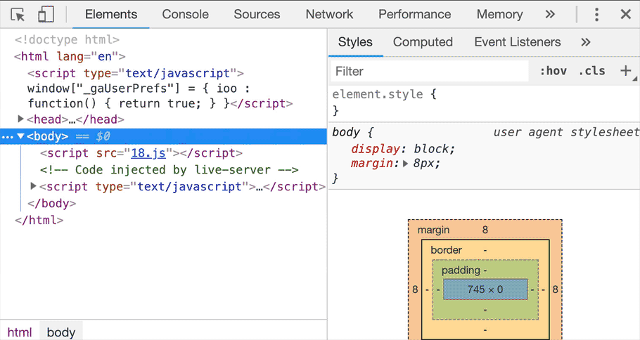
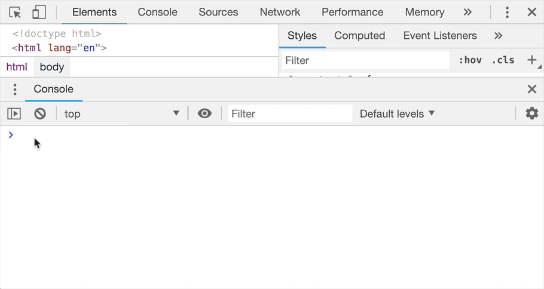
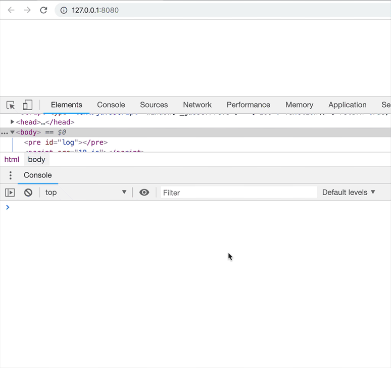
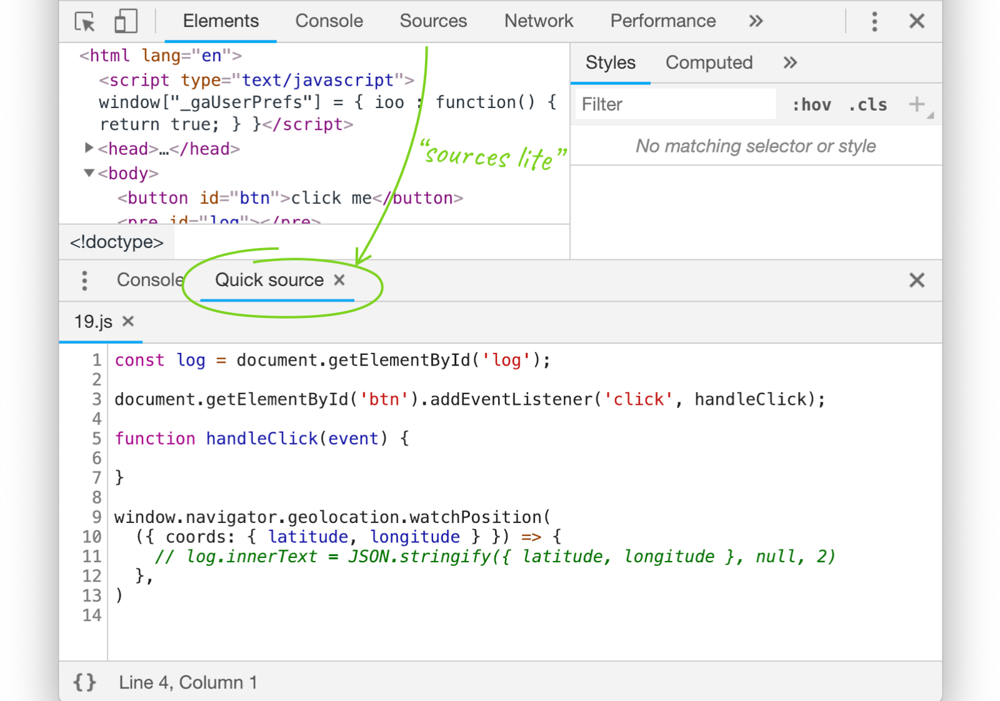
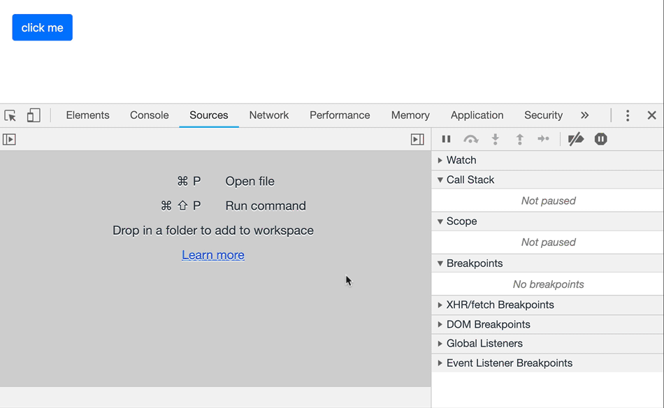
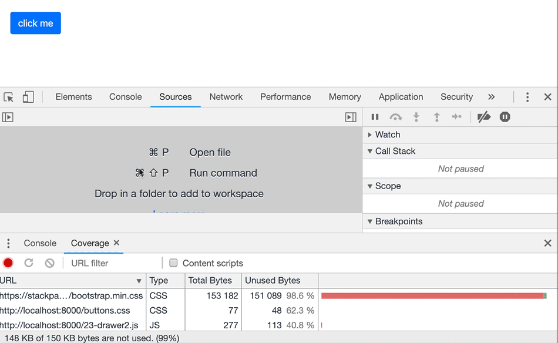
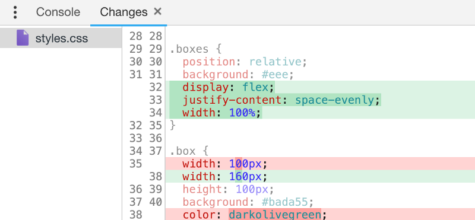
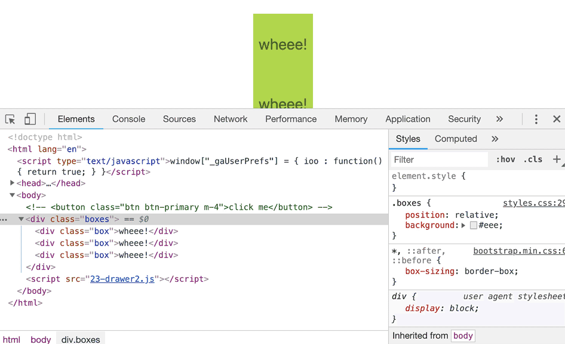

# Drawer 篇 - Drawer 常识

## 前言

说到 `Drawer` 大部分的朋友可能都很陌生，那 `Drawer` 是个什么东西？
`Chrome DevTools` 有很多部分，被分为9个 `tab` (俗称选项卡) ( `Elements` ， `Console` ， `Sources` ， `Network` ， 等等...)

但是，那仅仅是它的一部分而已！有一组平行的选项卡，被隐藏在主窗口之下。这个组合被称为 **`Drawer`**

## 1. 如何打开 `Drawer` ?

当你在 `DevTools`（任何选项卡）中时，按 `[esc]` 来显示它，再次按 `[esc]` 隐藏它：

<figure><figcaption></figcaption></figure>

默认情况下，您会看到一个 `console` 选项卡。 与主面板的 `console` 完全相同。 这就是为什么主面板会显示除了 `console` 之外的每个主要标签（ `Elements` ，`Sources` ，`Network` ...）- 因为在主面板中显示 `console` 没有意义。

这样的 `console` 很方便，例如在 `Elements` 选项卡打开时，我们同时可以看到 `console` 面板。但是在 `Drawer` 中其实还隐藏了更多细节。

## 2. `Drawer` 里面到底有什么？

`Drawer` 里隐藏着许多其他功能，大多数时候你可能不需要用到它们，这也是它们为什么被隐藏起来的原因，然鹅，你可以直接选择你想展示在这里的功能。

点击主页面在 `Drawer`的 `console` 面板前面的 `⋮` 图标来打开完整选项列表。另外，你也可以打开之前我们提到的 `command Menu` ，然后输入 `Drawer` 来打开

<figure><figcaption></figcaption></figure>

Okay，让我们再看一遍所有的选项：

*  `Animations`
*  `Changes`
*  `Console`
*  `Coverage`
*  `Network conditions`
*  `Performance monitor`
*  `Quick source`
*  `Remote devices`
*  `Rendering`
*  `Request blocking`
*  `Search`
*  `Sensors`
*  `What’s new`

## 3. 控制传感器

如果你正在你的应用中使用一些获取位置信息的 `API` 而且想要测试一下它，总不能开着车环绕世界吧，(其实也不是不行😉)。

`Drawer` 里的 `Sensors(传感器)` 面板可以让你模拟特定的位置: 支持从预定义的位置中进行选择，添加自己的位置，或者手动键入纬度/经度。选定的值将被 `navigator.geolocation.watchPosition`（或 `.getCurrentPosition` ）报告。

如果你的 `App` 使用加速计，传感器面板也可以模拟你设备在3D空间中的位置！

<figure><figcaption></figcaption></figure>

## 4 .模拟网络状态

就像伪造你的位置一样，你可以使用 `Drawer` 里的 `Network conditions` 面板模拟特定的网络行为：模拟互联网为典型的3G网络甚至离线！ 这通常用来了解页面资源的大小。或者测试应用的离线功能。
除此之外，`Network conditions` 面板还可以模拟特定的用户代理。

<figure><figcaption></figcaption></figure>

## 5.拿到 `source`

与 `drawer console` 一样，当我要专注于 `Elements` 面板时，有时我也想看源代码，这时就可以在 `drawer` 中选择显示 `Source`。

<figure><figcaption></figcaption></figure>

如你所见，或许没有 `“主”Source` 面板的花里胡哨的功能，没有 `call stack` 或者 `control` ( `pause`， `step over`， 等等)按钮。而且如果断点被触发，它也不会显示在 `drawer` 的 `Quick sources` 中，而是显示在主 `Source` 中。

但是对于 `快速查看代码` ，或者 `设置断点` 来说，它却是非常有用的技巧。

## 6. 检查代码 coverage

实际开发中，你的页面可能并不需要位于尾部的许多代码。也许那是来自外部库的一大块 `JavaScript` ，也许是被遗忘的选择器上的一些 `CSS` 规则，它们不再匹配任何东西。

使用 `coverage` 面板来获得关于冗余代码的摘要-细节信息。使用 `Drawer` 菜单或者 `Command` 菜单来打开它。

<figure><figcaption></figcaption></figure>

`DevTools` 的 `coverage` 工具可以跟踪当前加载的 `JS` 和 `CSS` 文件的 `哪些行正在被执行` ，并显示 `未使用字节的百分比` 。

它用 `绿色` 的线条标记 `运行` 和用 `红色` 的线条标记 `未运行` 。 举个例子：

<figure><figcaption></figcaption></figure>

## 7. 检查你修改的内容

通过浏览器进行设计和调整 `css` ：能够在代码执行的地方进行调试是方便又有趣的开发方式。 但在某些时候，你可能希望将 `已更改的内容` 与 `最初加载的样式表` 进行比较。

为此，可以使用 `DevTools' Drawer` 中的更改工具。

<figure><figcaption></figcaption></figure>

它不仅会使用差异形式的变化（像 `Git` 这样的源控制工具一样）向你展示，同时还可以撤销它们。

举个例子：

<figure><figcaption></figcaption></figure>

            